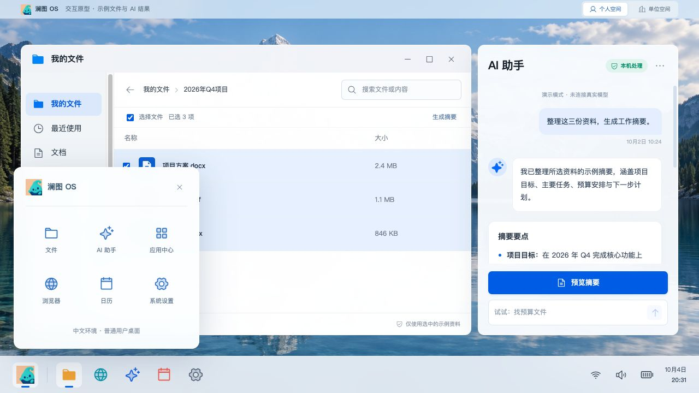

<p align="center"></p>
<h1 align="center">澜图 OS · Lantu OS</h1>
<p align="center">中文优先，让 AI 走进日常桌面。</p>
<p align="center">Debian 13 · KDE Plasma · Intel / AMD x86-64 · GPL-3.0-or-later</p>

澜图 OS 是面向中文用户的 Linux 桌面探索项目。它以 Debian 与 KDE Plasma 为基础，将中文输入、常用电脑设置和 AI 工作台放进统一的桌面体验，服务个人办公，并逐步探索学校、企业与公共机构的使用场景。

**当前版本：0.2.0-preview，开发预览版。** 已提供可构建的 Live / 安装 ISO 方案、原生系统控制桥接和可操作的 AI 界面原型。AI 摘要、文件整理和单位空间使用示例数据，尚未连接模型、真实文件索引或组织管理服务。适合开发、体验和测试；尚未完成生产环境验收。



## 已实现

| 功能 | 当前实现 |
| --- | --- |
| 中文桌面 | 简体中文、Noto CJK 字体、Fcitx5 拼音、KDE Plasma |
| 浏览器 | 镜像内 Firefox ESR；工作台通过系统浏览器打开 HTTP / HTTPS 网页 |
| 音量 | 读取音量、调节默认输出、静音、打开 KDE 声音设置 |
| 网络 | 读取活动连接，打开 NetworkManager / KDE 网络设置 |
| 电量与电源 | 读取设备真实电池状态；无电池时明确提示；提供电源设置入口 |
| 文件管理 | KDE Dolphin；工作台内另有示例文件交互 |
| AI 工作台 | 摘要、引用、搜索、整理确认和撤销的交互演示 |
| 系统品牌 | 澜澜 A2 Logo、壁纸、桌面入口、Live 启动菜单、安装器欢迎页 |
| 镜像构建 | 从经过 SHA-256 校验的 Debian KDE Live ISO 构建 amd64 混合启动镜像 |

浏览器预览中的音量是演示数值；只有 Linux 原生工作台连接真实系统。个人 / 单位切换用于展示场景，不构成身份认证或权限控制。

## 快速体验界面

需要 Node.js 22、npm：

```bash
git clone https://github.com/weeduon/lantu-os.git
cd lantu-os/desktop
npm ci
npm run dev -- --host 127.0.0.1
```

打开终端显示的本机地址。构建静态页面：`npm run build`；测试：`npm run test:sites`。

## 构建与安装 ISO

目标设备为 **64 位 Intel / AMD PC**。构建机使用独立的 **Debian 13 amd64 虚拟机**，建议 4 核、8 GB 内存、至少 40 GB 可用磁盘。镜像可用于 Live 试用，内含 Calamares 安装器。

```bash
bash scripts/prepare-iso.sh
# 下载并校验固定上游 ISO 后，在独立 Debian 构建虚拟机内执行：
sudo bash linux/build.sh "$PWD/downloads/debian-live-13.6.0-amd64-kde.iso" "$PWD/release"
```

完整步骤见 [构建说明](docs/BUILD.md)、[试用与安装](docs/INSTALL.md)、[验证状态](docs/STATUS.md)。ISO 和构建缓存不存入 Git。仓库内的构建配方会生成镜像与 SHA256SUMS；不要把 README 中的功能列表当作真机兼容性认证。

## 项目结构

```text
desktop/             React 工作台、选定 Logo、壁纸、网页测试
linux/native/        PyQt6 / Qt WebEngine 本地壳与受限系统接口
linux/overlay/       中文环境、首次登录设置、安装器品牌
linux/build.sh       安装软件、应用定制、生成 squashfs
linux/pack-iso.sh    保留上游 BIOS / UEFI 引导结构并输出 ISO
scripts/             前端准备和第三方源码获取辅助工具
docs/                构建、安装、验证、路线图和设计说明
.github/workflows/  源码检查与前端、原生桥接测试
```

## AI 路线

1. 接入可配置的本地模型 / 兼容 API，显示模型与数据发送范围。
2. 用户授权后索引真实文档，让摘要与引用能够回到原文。
3. 为真实文件操作提供预览、冲突检查、确认与撤销。
4. 增加组织身份、策略管理、审计和内网部署能力。

这些能力尚未实现。完整规划见 [路线图](docs/ROADMAP.md)。

## 参与和许可

欢迎通过 [Issues](https://github.com/weeduon/lantu-os/issues) 报告问题，通过 Pull Request 贡献代码。请先阅读 [贡献说明](CONTRIBUTING.md)。

本项目自有源码、文档及随项目提供的自有图像采用 **GPL-3.0-or-later**，见 [LICENSE](LICENSE)。Debian、Linux、KDE、Qt、Firefox、字体、固件和 npm 依赖保留各自许可证；本仓库的许可证不重新授权这些组件，见 [第三方说明](THIRD_PARTY_NOTICES.md)。这是独立社区项目，与 Debian、KDE 及其他厂商没有官方隶属关系。

### English

Lantu OS is a Chinese-first Linux desktop project based on Debian 13 and KDE Plasma for x86-64 PCs. It combines Chinese input, native PC controls, and an interactive AI workbench prototype. The current preview includes real Linux volume, network and battery integration; AI responses, document operations, and organization views remain demonstrations. Build instructions and source code are open for contributors.
